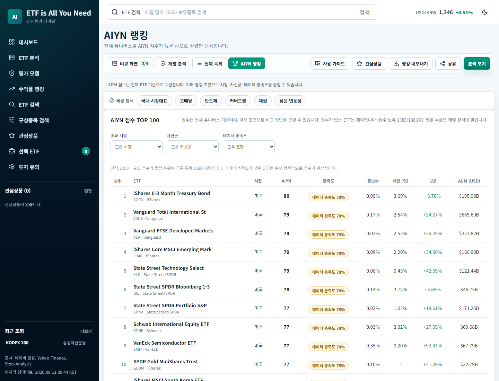
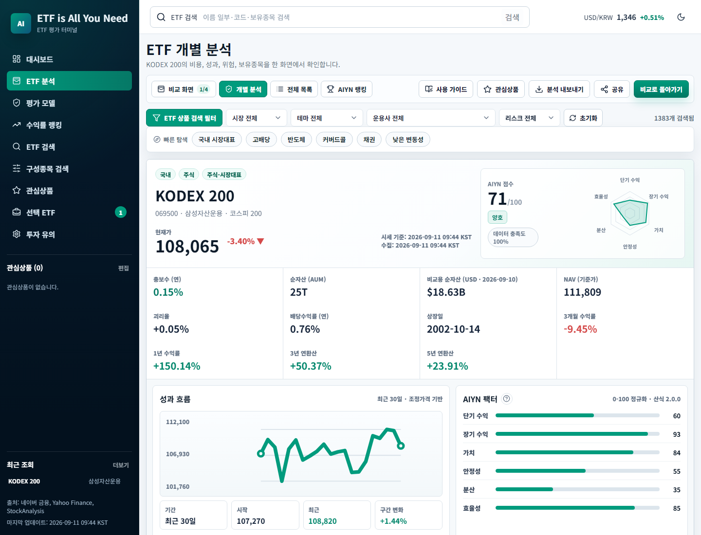
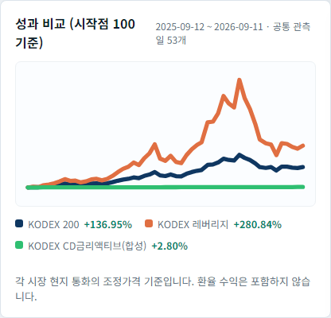

# EIAYN 후속 과제 개선 결과 — 2026-09-11

[최초 검토](project-review-2026-09-11.md)에 남긴 데이터·설계 과제 6개를 구현했다. 이 문서는 공개 배포 전 검토 자료다. 로컬에서 원천 갱신·빌드·화면 확인을 마쳤으며, 푸시 여부와 공개 서비스 반영 상태는 작업 완료 응답을 따른다.

## 완료한 여섯 과제

| 과제 | 구현 | 확인 근거 |
| --- | --- | --- |
| 규모 점수의 통화 통일 | 8개 통화를 동일 관측일의 USD 기준으로 환산. 규모 점수와 동점 순위에 `aumUsd` 사용. 원금액과 환율 기준일 유지. 모든 통화에 공통인 7일 이내 관측일이 없으면 갱신 실패 | `src/lib/currency.js`, `src/lib/scoring.js`, `scripts/data/exchange-rates.mjs`; 원화 숫자가 더 커도 달러 환산 규모로 순위를 정하는 회귀 검사 |
| 성과 비교 날짜 정렬 | 거래소 현지 날짜를 보존한 주간 관측일 배열 추가. ETF 간 날짜 교집합만 재정규화하며 차트 가로축도 실제 경과 일수로 배치. 날짜 없는 자료는 제외 | `scripts/data/performance.mjs`, `scripts/data/yahoo.mjs`, `src/lib/overlay.js`; 휴장·기간 차이·중복 날짜·잘못된 값 검사 |
| 시세·수집 시각 분리 | 국내 종목별 네이버 시세의 가격·등락률·`localTradedAt`을 함께 수집. 요청 실패 시 목록 가격을 쓰되 실제 거래 시각은 미확인. 모든 시장에서 `quoteCollectedAt` 별도 저장·표시 | `scripts/data/naver.mjs`, `src/components/common/QuoteTime.jsx`; 시각 누락 시 수집 시각으로 대체하지 않는 검사 |
| 충족도·비교 집단·산식 이력 | 시장·자산군·최소 충족도 랭킹 조건 추가. URL·새로고침·CSV에 동일하게 반영. 일곱 점수 구성요소의 누락 표시. 산식 버전 저장 및 같은 버전끼리만 이력 연결 | `src/lib/ranking.js`, `AiynRankingView.jsx`, `ScoreCoverageBadge.jsx`, `scripts/data/history.mjs`, `ScoreTrend.jsx` |
| 초기 데이터 로딩 분리 | 검색용 목록과 ETF별 상세 파일을 빌드에서 생성. 이름·구성종목 검색은 목록만 사용. 분석·비교에 선택된 ETF만 상세 요청. 전체 스냅샷 API 유지 | `scripts/build-catalog.mjs`, `useEtfData.js`, `useEtfDetails.js`; 목록 단독 검색·요청 수·서로 다른 버전 거부·재시도·응답 역전·오프라인 검사 |
| 사이드바 이동 | 대상 화면을 연 뒤 평가 모델·수익률 랭킹·관심상품·비교 바구니·투자 유의로 이동. 상세 로딩 후 이동해 레이아웃 변경으로 목적지가 밀리지 않게 처리 | `src/App.jsx`, `Sidebar.jsx`; 전체 목록에서 각각 이동하는 브라우저 검사 |

## 점수 변경 영향

산식 버전을 **1.0.0 → 2.0.0**으로 올렸다. 가중치와 다른 구성요소의 정규화는 유지하고, 규모의 비교 통화만 바로잡았다. 원화·동화처럼 통화 단위가 큰 상품이 숫자 크기만으로 유리해지는 오류를 수정한 것이다.

시장 움직임과 데이터 갱신 영향을 제거하기 위해 **동일한 새 스냅샷**을 이전 커밋의 산식과 수정 산식에 각각 넣어 비교했다.

- 대상 ETF 1,383개 모두 점수가 변경됐다.
- 절대 점수 차이: 평균 **3.84점**, 최대 **8점**.
- 상위 100개 목록의 **50개 교체**.
- 기존 점수 이력은 재계산하지 않는다. 이전 이력에는 버전 1.0.0을 명시하고 9월 11일부터 2.0.0으로 기록했다.
- 산식 전환일의 차이는 `scoreMoves` 급변 알림에 넣지 않고 `scoreModelChange`로 따로 알린다.

점수는 여전히 전체 ETF 유니버스의 상대 평가다. 자산군 필터는 같은 자산군 안에서 목록의 순위를 매기는 기능이며 자산군별로 점수 자체를 다시 계산하는 기능은 아니다. 충족도는 구성요소의 가중치 합이며 모든 세부 지표의 완전성을 뜻하지 않는다.

## 갱신 자료 확인

- 스냅샷 생성 시작: **2026-09-11 09:44 KST**. 개별 시세 관측·수집 시각은 각 ETF에 보존한다.
- ETF **1,383개**: 국내 1,168, 미국 157, 홍콩 13, 독일 10, 프랑스 8, 일본 10, 호주 11, 베트남 6.
- 환율 공통 기준일 **2026-09-10**: USD·KRW·HKD·CNY·EUR·JPY·AUD·VND. USD 환산 순자산 **1,383개**.
- 실제 시세 관측 시각 **1,383개**, 국내 **1,168개** 전부 확보.
- 관측일이 포함된 성과 자료 **1,356개**. 부족한 27개는 추정하지 않는다.
- 기본 비교 바구니: **2025-09-12~2026-09-11**, 공통 관측일 **53개**.
- 점수 이력 **46일**. 버전 전환으로 새 산식의 추이는 현재 1일부터 시작한다.

갱신 과정에서 미국 고거래량 목록의 교체도 확인했다. 이 변화가 실제 상장·상장폐지로 읽히지 않도록 화면과 RSS의 문구를 **목록 편입·목록 제외**로 정정했다. 기존 외부 API 필드명 `newListings`·`delisted`는 유지한다.

## 로딩 크기

아래는 파일 바이트와 로컬 gzip 측정이다. 실제 호스팅 전송량은 압축 설정과 캐시 여부에 따라 달라질 수 있다.

| 자료 | 원본 바이트 | gzip 바이트 |
| --- | ---: | ---: |
| 이전 커밋 전체 스냅샷 (Git의 LF 파일) | 6,874,639 | 820,411 |
| 관측일·시각·환율을 추가한 새 전체 스냅샷 | 9,307,029 | 932,820 |
| 초기 검색용 목록 | 2,241,258 | 381,409 |

- 이전 초기 데이터 대비 gzip **약 54% 감소**. 새 전체 자료와 비교하면 **약 59% 감소**.
- 기본 ETF 3개의 상세 자료는 합계 **7,031바이트**이며 선택한 항목만 요청한다.
- 목록과 상세에 같은 스냅샷 식별자를 넣고 상세 파일명에는 해시를 사용한다. 서로 다른 배포의 자료가 섞이면 오류를 표시하고 목록 갱신을 안내한다.
- 오프라인은 이미 조회·캐시한 목록과 상세를 지원한다. 미조회 ETF를 오프라인에서 열면 상세 자료가 없는 이유와 재시도를 표시한다.

## 검증

- 단위 테스트 **408개**, 브라우저 테스트 **33개** 통과.
- 데이터 스키마·환율 환산·관측일 검사, ESLint, Prettier, 빌드 통과.
- 브라우저 검사: 검색이 상세 파일을 요청하지 않음, 선택 시 한 ETF 상세만 요청, 버전 불일치 차단·재시도, 빠른 선택 변경 시 이전 응답 무시, 랭킹 조건의 새로고침·CSV 일치, 산식 이력 분리, 사이드바 목적지 이동.
- 오프라인 검사는 브라우저 오프라인 설정과 서비스 워커의 네트워크 실패를 함께 재현해 캐시 복원·미조회 오류·온라인 복구를 확인했다.
- PC 1440×1100, 모바일 390×844의 밝은 화면·다크 모드를 확인했다. 화면 확인 중 JavaScript 예외 **0건**, 모바일 문서 폭 **390px**.

## 화면

[모바일](followup-2026-09-11/ranking-mobile.png) · [모바일 다크 모드](followup-2026-09-11/ranking-mobile-dark.png)
