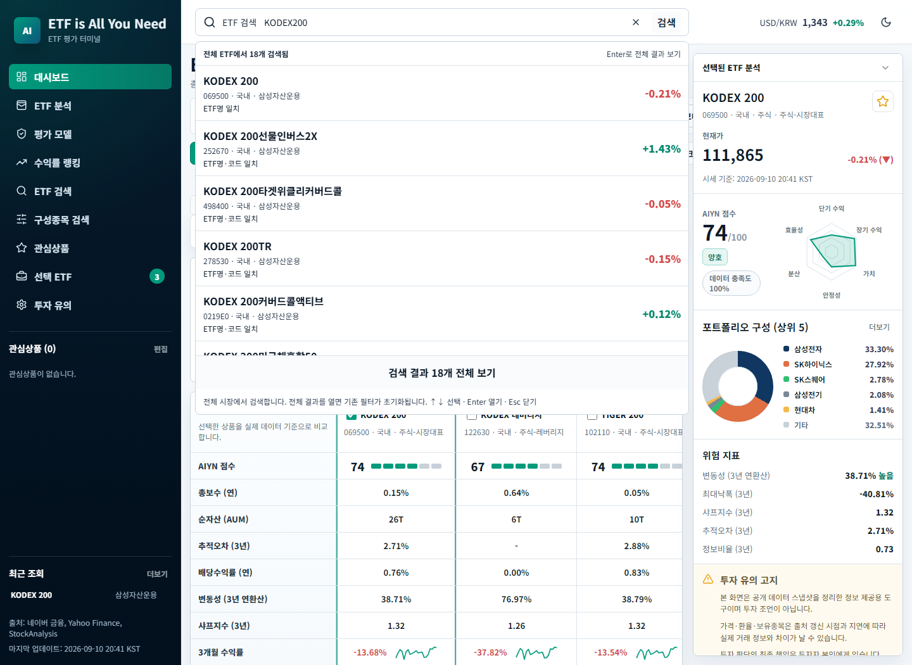
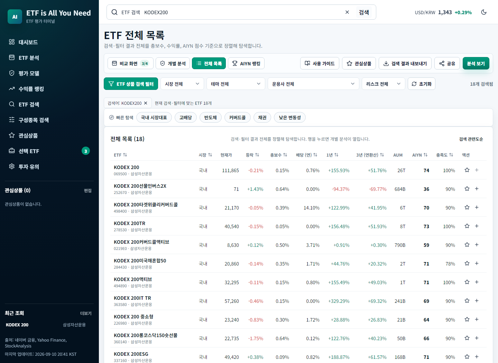

# EIAYN 전반 검토 및 개선 — 2026-09-11

검색 정확성과 검색 방법의 불명확함을 우선 해결하고, 초기 데이터 오류 복구·URL 복원·저장값 검증·캐시 격리·배포 검증을 개선했다. 비교·분석·전체 목록·AIYN 랭킹과 데이터 수집·검증·배포 경로를 함께 검토했다. 금융 원천 데이터 전건을 외부 출처와 대조한 감사는 아니며, 아래 수치는 커밋된 스냅샷과 코드에 대한 측정 결과다.

## 프로젝트 현황

- React 18 + Vite 6 기반 정적 GitHub Pages 앱. 별도 애플리케이션 서버 없이 공개 JSON을 읽는다.
- 검토 시작 시 로컬 `main`은 원격보다 30개 커밋 뒤에 있었다. 작업 트리가 비어 있음을 확인한 뒤 `f47e137`까지 fast-forward해 최신 데이터와 기존 수정 사항을 보존했다.
- 적용 후 프런트엔드 제품 코드 52개 파일, 28개 JSX 컴포넌트, 약 7,456줄(CSS 포함). 테스트·수집·생성 코드를 포함한 `scripts`의 MJS 파일은 34개다. 이후 소규모 문구·스타일 변경으로 줄 수는 달라질 수 있다.
- 데이터 생성 시각: **2026-09-10 20:41 KST** (`2026-09-10T11:41:53.531Z`). 이는 데이터 묶음의 생성 시각이며 모든 기초 데이터의 실제 관측 시각이 동일함을 보장하지 않는다.
- 직전 갱신 작업 `34472645510`과 배포 `34472798991`의 성공을 GitHub Actions에서 확인했다.

| 시장 | ETF 수 |
| --- | ---: |
| 국내 | 1,168 |
| 미국 | 158 |
| 홍콩 | 13 |
| 독일 | 10 |
| 프랑스 | 8 |
| 일본 | 10 |
| 호주 | 11 |
| 베트남 | 6 |
| 합계 | **1,384** |

| 데이터 항목 | 확보된 ETF 수 |
| --- | ---: |
| 총보수·순자산 | 1,384 |
| 배당수익률 | 1,330 |
| 보유종목 이름 | 1,212 |
| 비중이 있는 보유종목 1개 이상 | 541 |
| 1년 주간 성과 시계열 | 1,357 |
| 3년 변동성 필드 | 1,378 |
| 추적오차 필드 | 100 |
| 순자산가치(NAV) | 1,168 |
| AIYN 점수 | 1,384 |
| 점수 계산요소 충족도 100% | 30 |
| 점수 계산요소 충족도 80% 미만 | 778 |

필드 존재 여부를 센 값이며, 관측 기간·출처·정확성까지 독립적으로 검증한 수치는 아니다. 점수 이력은 45개 날짜, 약 724KB다.

## 발견한 문제와 적용한 수정

| 우선순위 | 문제와 재현 조건 | 적용한 수정 | 주요 근거 |
| --- | --- | --- | --- |
| 높음 | 단일 문자열 포함 검사로 `KODEX200`, `나스닥 100`, `삼성 전자`가 0건 | 유니코드·공백·구분자 정규화, 여러 단어의 AND 검색, 주요 한·영 표기 확장 | `src/lib/search.js`, `search.test.js` |
| 높음 | 전체 검색에 기존 시장·운용사 필터가 적용되어 상품을 찾지 못함 | 상단 검색은 전체 ETF 대상. 전체 결과를 열 때 필터 초기화하고 그 동작을 안내 | `src/App.jsx`, `TopBar.jsx`, `e2e/search.e2e.js` |
| 높음 | 정확한 ETF보다 보유종목이나 메타데이터 일치 결과가 먼저 나올 수 있음 | 정확한 코드 → 정확한 이름 → 이름 일부 → 메타데이터 → 보유종목 순으로 정렬 | `src/lib/search.js` |
| 보통 | 검색창에서 무엇을 입력하고 어떻게 결과를 여는지 불명확 | 검색 예시, 검색·지우기 버튼, 검색된 이유, 전체 결과 버튼, 안내 문구 추가 | `TopBar.jsx`, `src/styles.css` |
| 보통 | Enter가 임의의 첫 상품을 열고 방향키 선택을 지원하지 않음 | Enter는 전체 결과, 방향키 선택 후 Enter는 해당 분석. 한글 조합 중 Enter는 이동하지 않음 | `TopBar.test.jsx` |
| 보통 | 결과 팝업이 입력창 포커스 이탈 즉시 사라져 키보드 접근이 불편함 | 검색 영역 내부로 이동할 때 팝업 유지, combobox/listbox 관계·선택 상태 제공 | `TopBar.jsx`, `TopBar.test.jsx` |
| 보통 | 이름이 말줄임되어 비슷한 상품을 구분하기 어려움 | 검색 결과에는 전체 이름을 줄바꿈해 표시. 목록은 검색 관련도순과 지표 정렬을 선택 가능 | `TopBar.jsx`, `EtfTable.jsx` |
| 보통 | 검색·필터가 새로고침과 뒤로가기에서 사라지거나 앞뒤 화면이 섞임 | URL 동기화와 popstate 복원, 존재하지 않는 필터는 기본값으로 정리 | `searchState.js`, `App.jsx`, `e2e/search.e2e.js` |
| 보통 | 결과가 0개여도 하단 수익률 랭킹이 전체 ETF로 돌아감 | 결과 없음 상태를 그대로 표시하고 검색어·필터 해제 동작 제공 | `App.jsx`, `RankingPanel.jsx` |
| 보통 | AIYN 랭킹에 적용되지 않는 필터가 작동하는 것처럼 보임 | 해당 화면에서는 필터 대신 전체 ETF 기준이라는 설명을 표시 | `WorkspaceHeader.jsx` |
| 보통 | 사이드바 검색 메뉴가 검색창을 활성화하지 않음 | ETF 검색·구성종목 검색 메뉴가 실제 상단 검색창에 포커스 | `Sidebar.jsx` |
| 높음 | 최초 fetch 실패 시 `!initialized`가 오류 화면을 가려 무한 로딩 | 오류 화면 우선 표시, 재시도, 빈 데이터·잘못된 형태 검사, 20초 제한, 이전 요청 취소 | `useEtfData.js`, `App.jsx`, `useEtfData.test.js`, `e2e/search.e2e.js` |
| 보통 | 유효한 JSON이지만 배열이 아닌 관심상품 저장값이 앱을 중단시킴 | 문자열 ID 배열인지 검증하고 잘못된 값은 빈 목록으로 복구 | `usePersistentState.js`, `App.jsx`, `e2e/search.e2e.js` |
| 높음 | 서비스 워커 활성화가 같은 origin의 다른 앱 캐시까지 삭제 | EIAYN의 이전 캐시만 삭제, 앱 경로 밖 요청 제외, 자체 캐시에서만 조회 | `public/sw.js`, `scripts/service-worker.test.mjs` |
| 보통 | 목록·랭킹에서도 CSV 버튼이 비교 내보내기로 표시 | 실제 내보내는 화면에 맞는 버튼 이름으로 변경 | `WorkspaceHeader.jsx` |
| 보통 | 모바일 다크 모드 버튼과 의미 없는 비활성 메뉴 버튼 | 동작하지 않는 메뉴 버튼 제거, 모바일에서도 테마 전환 유지 | `TopBar.jsx`, `src/styles.css` |
| 보통 | 가이드에서 키보드 포커스가 배경으로 빠짐 | 닫기 버튼에 초기 포커스, 현재 유일한 조작 버튼 안에서 Tab 유지, 닫힌 후 이전 포커스 복원 | `GuideModal.jsx` |
| 보통 | 로컬 Node 20.13.1에서 테스트 의존성 로딩 실패 | 실제 테스트에 Node 24.19.0 사용. 프로젝트에 Node 24 이상 요구와 `.node-version` 명시 | `package.json`, `.node-version`, README |
| 낮음 | Windows 자동 CRLF 변환과 프로젝트 LF 규칙이 충돌하고 일부 파일의 포맷이 이탈 | `.gitattributes`에 LF 체크아웃 규칙을 추가하고 Prettier로 코드 포맷 정리 | `.gitattributes`, `npm run format:check` |
| 보통 | `main` 배포가 브라우저 검증 없이 진행됨 | 배포 전에 ESLint와 Playwright E2E 필수 실행 | `.github/workflows/deploy-pages.yml` |
| 낮음 | README 갱신 일정과 점수 문서의 데이터 출처가 이전 구현을 설명 | 실제 예약 15:35 KST와 네이버 금융 우선 수익률 경로로 정정 | README, `docs/scoring.md` |

## 검색 전후 재현

추가로 사용자 Chrome의 실제 탭에서 네 필터가 모두 ‘전체’로 표시되는데 `배당` 검색은 0건인 상태를 확인했다. 입력 문자도 정상 한글이었다. 그 탭에서 초기화 후 같은 `배당`을 입력하자 80건으로 복구됐다. 표시된 선택값과 내부 필터 상태의 불일치가 의심되며, 정확히 어떤 이전 조건이 남아 있었는지까지 단정하지 않는다. 수정본은 URL의 유효하지 않은 필터를 정리하고 상단 검색과 화면 필터를 분리해 이 영향을 차단한다. `market=전체` 등 잘못된 값이 들어온 상태에서도 `배당`을 찾는 브라우저 회귀 테스트를 추가했다.

동일한 2026-09-10 스냅샷에서 측정했다. 검색 건수는 다음 데이터 갱신에서 변할 수 있다. 검색 결과에는 이름뿐 아니라 보유종목·운용사·지수 일치도 포함되며, 일치 이유로 구분한다.

| 검색어 | 수정 전 | 수정 후 | 결과 예 |
| --- | ---: | ---: | --- |
| `KODEX200` | 0 | 18 | KODEX 200이 첫 번째 |
| `삼성 전자` | 0 | 252 | 관련 이름의 ETF와 삼성전자를 보유한 ETF |
| `미국 배당` | 1 | 33 | TIGER 미국배당다우존스 등 |
| `나스닥 100` | 0 | 42 | 국내 나스닥100 상품과 관련 지수 ETF |
| `069500.KS` | 0 | 1 | KODEX 200 |
| `QQQ` | 11 | 11 | QQQ 자체가 첫 번째, TQQQ·SQQQ 등은 뒤에 표시 |

초성 검색이나 임의 오타 교정은 구현하지 않았다. 한·영 표기는 코드에 정의한 주요 브랜드·지수·회사에 한정한다. 보유종목 자료가 없는 172개 ETF에 대해 구성종목을 추정해서 검색하지 않는다.

[모바일 검색 화면](review-2026-09-11/search-mobile.png) · [모바일 다크 모드](review-2026-09-11/search-mobile-dark.png)

## 성능·보안·구조 평가

| 영역 | 평가 | 확인 사항 |
| --- | --- | --- |
| 검색 정확성·사용성 | 주요 결함 개선 | 이름·코드·보유종목 구분, 전체 결과 동선, 모바일 터치·키보드 조작 검증 |
| 오류 복구 | 주요 결함 개선 | 초기 503·빈 데이터·저장값 손상·시간 초과·취소된 요청의 응답 역전 검증 |
| 보안 | 개선, 제한된 검사에서 중대 문제 미발견 | 앱 간 캐시 삭제 문제 수정. HTML 직접 삽입 사용이 없고 CSV 수식 방어가 존재. `npm audit --omit=dev`에서 알려진 운영 의존성 취약점 0건. 침투 테스트는 수행하지 않음 |
| 성능 | 현재 규모에서 양호, 초기 데이터 다운로드 개선 여지 | 검색 인덱스 생성 약 76ms, 1,384개 대상 대표 검색 3~6ms. 로컬 Node에서 측정한 참고값으로 모바일·네트워크 성능 보장은 아님 |
| 유지보수 | 검증 기반이 있으나 화면 조정 책임 집중 | 검색·URL 로직 분리, Node 버전과 배포 게이트 명시. `App.jsx`의 화면 전환·공유·선택 상태는 다음 단계 분리 대상 |
| 데이터 해석 | 추가 설계 필요 | 서로 다른 통화·관측 시점·점수 충족도 문제는 아래 후속 과제로 분리 |

- 데이터 JSON: 7,181,091바이트, 로컬 gzip 기준 827,546바이트. 실제 전송량은 호스팅의 응답 압축 방식에 따라 다르다.
- 제품 JS 번들 약 235KB, gzip 약 73KB. CSS 약 43KB, gzip 약 8KB. 새 검색 라이브러리는 추가하지 않았다.
- 현재 수집 재시도·타임아웃, 데이터 검증 후 커밋, 선택적 부가 자료 로딩, 점수 계산의 `null` 처리, 화면과 JSON 랭킹의 공통 정렬 로직은 유지할 만한 기반이다.

## 후속으로 남긴 데이터·설계 과제

1. **AIYN 규모 점수의 통화 통일 — 높음.** `src/lib/scoring.js`는 `etf.aum`을 통화 환산 없이 `logAum` 분포에 넣는다. `src/lib/ranking.js`의 동점 정렬에도 원금액이 사용된다. 원화 1조와 달러 10억을 숫자 크기로 비교하면 규모 해석이 왜곡된다. 모든 통화의 동일 기준일 환율을 수집해 공통 통화로 환산하거나, 같은 시장 안에서 평가하는 정책이 필요하다. 점수 정책·기존 점수 이력·공개 랭킹이 바뀌므로 이번 검색 수정에서 점수를 임의 재산출하지 않았다.
2. **성과 비교의 날짜 정렬 — 높음.** `src/lib/overlay.js`는 끝에서 같은 개수의 값을 자르며, 각 시계열의 실제 관측 날짜를 맞추지 않는다. `performance1y`에는 시작일·주기·값만 있고 중간 휴장이나 끝 날짜 차이를 완전히 판별할 정보가 없다. 수집 단계에서 각 관측일을 저장하고 공통 날짜 구간으로 비교해야 한다. 현재 스키마를 추정 날짜로 변환하지 않았다.
3. **시세 시각과 수집 시각 구분 — 보통.** 국내 ETF의 `dataQuality.quoteAsOf`에 수집 실행 시각이 들어간다 (`scripts/fetch-etf-data.mjs`). 실제 거래일과 수집 시각을 별도 저장해야 장중·휴장·지연 데이터를 정확히 표시할 수 있다. 다른 시장의 이력·환율도 각 관측 시각을 유지하는 것이 필요하다.
4. **점수 충족도와 비교 집단 — 보통.** 778개 ETF는 점수 요소 충족도가 80% 미만이다. 충족도별 표시와 같은 자산군 안의 순위를 강화하고, 점수 이력에 모델 버전을 저장하면 데이터 확보나 산식 변화에 따른 점수 변동을 구별할 수 있다.
5. **초기 로딩 자료 분리 — 보통.** 탐색에 필요한 가벼운 메타데이터와 상세 보유종목·가격 이력을 분리하고 선택 시 상세를 가져오면 느린 모바일 연결에서 이득이 있다. 기존 데이터 API·캐시·오프라인 동작의 호환성을 고려한 별도 변경이 적절하다.
6. **나머지 사이드바 이동 — 낮음.** 평가 모델·수익률 랭킹 등 일부 메뉴는 화면 내부 앵커를 사용하므로 해당 영역이 없는 전체 목록·랭킹 화면에서는 이동 목적을 충족하지 못한다. 모든 메뉴를 화면 전환 상태와 통합하는 작업이 남아 있다. 검색 메뉴 두 개는 이번에 실제 검색창으로 연결했다.

## 신규 기능 제안

| 우선순위 | 기능 | 사용자가 얻는 가치 | 첫 구현 범위와 필요한 데이터 |
| --- | --- | --- | --- |
| 1 | 보유종목으로 ETF 찾기 전용 화면 | 삼성전자·엔비디아 검색 후 어떤 ETF에 얼마나 들어 있는지 비교 | 지금 추가한 검색 이유를 기반으로 일치 종목·비중·보유 내역 기준일 표시. 비중 없는 843개는 수치를 추정하지 않고 미제공으로 표시 |
| 2 | 관심 검색 저장 | `미국 배당`, `국내 반도체` 같은 조건을 다시 입력하지 않고 재사용 | 검색어·필터·정렬을 이름 붙여 브라우저에 저장, URL 공유. 서버 없이 가능 |
| 3 | 유사 ETF 비교 | 같은 지수를 추종하는 ETF의 비용·규모·추적오차를 한 번에 비교 | 같은 benchmark/시장 후보부터 제공, 비교 바구니 추가. 동일 지수 표기 정규화와 통화 기준 정리가 선행 과제 |
| 4 | 포트폴리오 보유종목 중복 분석 | 여러 ETF를 사도 같은 주식에 집중되는지 확인 | ETF별 투자 비중 × 공개된 구성종목 비중으로 겹침 표시. 미공개·미확인 부분을 별도로 표시하고 전체 포트폴리오를 안다고 가정하지 않음 |
| 5 | 관심상품 변화 요약 | 보수 인하, 신규 편입, 점수 변화를 자신의 관심상품 중심으로 확인 | 기존 `changes.json`을 관심상품으로 필터. 구성 변경은 보유종목 이력 수집 이후 제공. 외부 알림은 별도 구독·발송 설계 필요 |

구현 순서는 **보유종목 검색 결과 강화 → 관심 검색 저장 → 데이터 기준 보정 후 유사 ETF 비교·중복 분석**을 제안한다.

## 검증 기록

- 최신 원격 기준 변경 전: 단위 테스트 358개 통과, ESLint·데이터 검사 통과.
- 수정 후: 단위 테스트 **392개**, Playwright 브라우저 시나리오 **26개** 통과. 최신 스냅샷을 사용하는 기존 테스트의 고정 검색 건수 가정을 실제 상품 우선순위 검증으로 바꿨다.
- Playwright에서 이름 일부·띄어쓰기·영문 코드·기존 필터 우회·전체 보기·방향키·뒤로가기·새로고침·모바일 터치·503 재시도·빈 스냅샷·잘못된 저장값을 확인했다.
- 브라우저 화면 확인: PC 1440×1050, 모바일 390×844, 모바일 다크 모드. 캡처 세션의 JavaScript 예외 0건, 모바일 전체 문서 폭 390px로 가로 넘침 없음.
- `npm run lint`, `npm run format:check`, `npm run build`, `npm run check:data`, `git diff --check`로 정적 검사·코드 포맷·번들 생성·데이터·패치를 검증했다.
- 데이터 갱신은 실행하지 않았다. `public/data`의 원천 스냅샷과 AIYN 산식은 기존 최신 원격 상태를 유지한다.
- 새 배포에는 단위 테스트·ESLint·Playwright 통과 게이트가 적용된다. 실제 배포 성공과 공개 URL 확인 결과는 작업 완료 응답에 기록한다.
